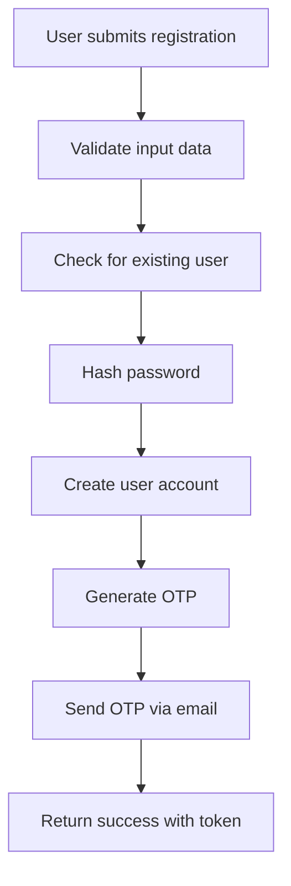
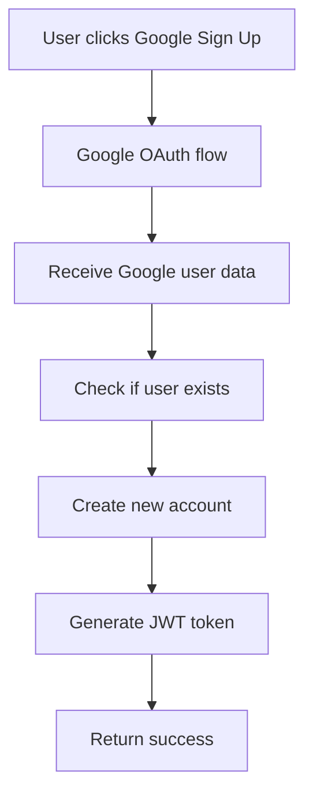
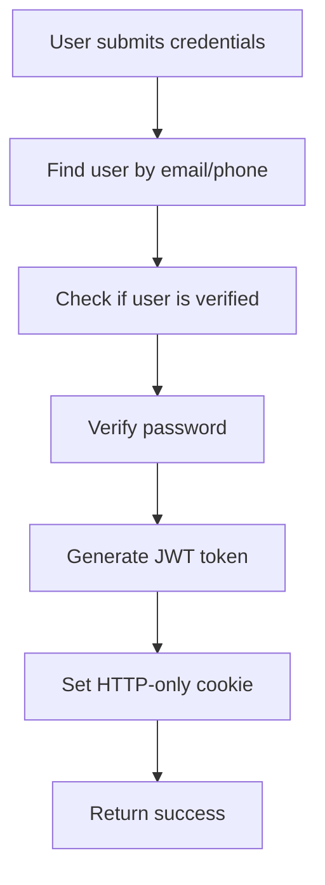
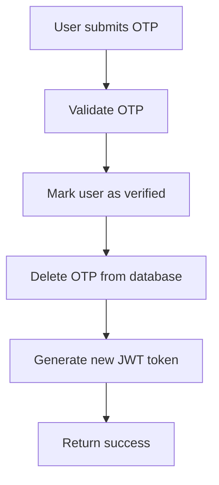
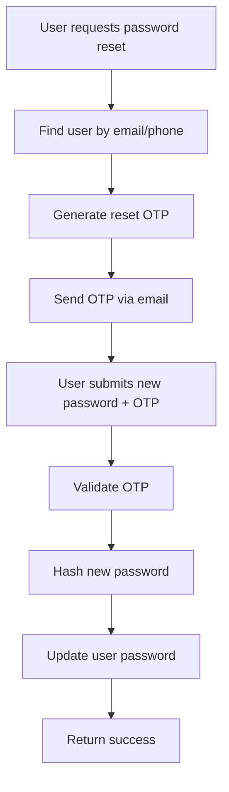

# BitesBay Authentication System

This document provides a comprehensive guide to the authentication system used in BitesBay backend, including user types, authentication flows, security measures, and implementation details.

**Last Updated:** January 2025

---

## Overview

BitesBay implements a multi-role authentication system supporting four distinct user types:
- **Users** - Regular customers who place orders
- **Vendors** - Food court operators and restaurant owners
- **Universities** - Educational institutions managing the platform
- **Admins** - System administrators with full access

## User Types & Roles

### 1. Users (Regular Customers)
- **Role:** `user`
- **Access:** Order placement, profile management, order history
- **Authentication:** Email/Phone + Password, OTP verification, Google OAuth

### 2. Vendors (Food Court Operators)
- **Role:** `vendor`
- **Access:** Menu management, order processing, inventory tracking
- **Authentication:** Email/Phone + Password, OTP verification, Google OAuth

### 3. Universities (Institution Management)
- **Role:** `university`
- **Access:** Vendor management, charge configuration, analytics
- **Authentication:** Email/Phone + Password, OTP verification, Google OAuth

### 4. Admins (System Administrators)
- **Role:** `admin`
- **Access:** Full system access, user management, system monitoring
- **Authentication:** Email + Password, JWT tokens

---

## Authentication Flows

### 1. Registration Flow

#### Standard Registration


#### Google OAuth Registration


### 2. Login Flow

#### Standard Login


#### OTP Verification Flow


### 3. Password Reset Flow


---

## Security Implementation

### 1. Password Security
- **Hashing:** bcrypt.js with salt rounds of 10
- **Validation:** Minimum 6 characters, alphanumeric
- **Storage:** Only hashed passwords stored in database

### 2. JWT Token Security
- **Algorithm:** HS256 (HMAC SHA-256)
- **Expiration:** 7 days
- **Storage:** HTTP-only cookies in production
- **Refresh:** Automatic token refresh mechanism

### 3. OTP Security
- **Generation:** 6-digit random numbers (100000-999999)
- **Expiration:** 10 minutes
- **Storage:** Separate OTP collection with automatic cleanup
- **Rate Limiting:** Maximum 3 attempts per email

### 4. Session Management
- **Cookies:** HTTP-only, secure in production
- **SameSite:** Strict policy
- **Max Age:** 7 days
- **Logout:** Token invalidation and cookie clearing

---

## API Endpoints

### User Authentication (`/api/user/auth`)

#### Registration
```http
POST /api/user/auth/signup
Content-Type: application/json

{
  "fullName": "John Doe",
  "email": "john@example.com",
  "phone": "1234567890",
  "password": "password123",
  "gender": "male",
  "uniID": "university_id"
}
```

**Response:**
```json
{
  "message": "Account created successfully. OTP sent for verification.",
  "token": "jwt_token_here",
  "role": "user",
  "id": "user_id"
}
```

#### OTP Verification
```http
POST /api/user/auth/otpverification
Content-Type: application/json

{
  "email": "john@example.com",
  "otp": "123456"
}
```

#### Login
```http
POST /api/user/auth/login
Content-Type: application/json

{
  "identifier": "john@example.com",
  "password": "password123"
}
```

#### Forgot Password
```http
POST /api/user/auth/forgotpassword
Content-Type: application/json

{
  "identifier": "john@example.com"
}
```

#### Reset Password
```http
POST /api/user/auth/resetpassword
Content-Type: application/json

{
  "identifier": "john@example.com",
  "otp": "123456",
  "newPassword": "newpassword123"
}
```

#### Google Authentication
```http
POST /api/user/auth/googleAuth
Content-Type: application/json

{
  "credential": "google_credential_token"
}
```

### Vendor Authentication (`/api/vendor/auth`)
Similar endpoints as user auth with vendor-specific logic.

### University Authentication (`/api/uni/auth`)
Similar endpoints as user auth with university-specific logic.

### Admin Authentication (`/api/admin/auth`)

#### Admin Login
```http
POST /api/admin/auth/login
Content-Type: application/json

{
  "email": "admin@bitesbay.com",
  "password": "admin_password"
}
```

#### Admin Profile
```http
GET /api/admin/auth/profile
Authorization: Bearer <admin_token>
```

---

## Middleware Implementation

### 1. Authentication Middleware
```javascript
// authMiddleware.js
const jwt = require("jsonwebtoken");

exports.authMiddleware = (req, res, next) => {
  try {
    const authHeader = req.headers.authorization;
    
    if (!authHeader || !authHeader.startsWith("Bearer ")) {
      return res.status(401).json({ message: "Authorization token missing" });
    }

    const token = authHeader.split(" ")[1];
    const decoded = jwt.verify(token, process.env.JWT_SECRET);
    
    req.user = { userId: decoded.userId };
    next();
  } catch (error) {
    res.status(401).json({ message: "Invalid or expired token" });
  }
};
```

### 2. Role-Based Access Control
```javascript
// adminAuthMiddleware.js
exports.requireAdmin = (req, res, next) => {
  if (!req.user || req.user.role !== 'admin') {
    return res.status(403).json({ message: "Admin access required" });
  }
  next();
};
```

### 3. Rate Limiting
```javascript
// rateLimit.js
const rateLimit = require('express-rate-limit');

const authLimiter = rateLimit({
  windowMs: 15 * 60 * 1000, // 15 minutes
  max: 5, // limit each IP to 5 requests per windowMs
  message: 'Too many authentication attempts'
});
```

---

## Error Handling

### Common Authentication Errors

#### 400 Bad Request
- Invalid email format
- Password too short
- Missing required fields
- User already exists

#### 401 Unauthorized
- Invalid credentials
- Expired token
- Missing authorization header

#### 403 Forbidden
- Insufficient permissions
- Account not verified
- Admin access required

#### 429 Too Many Requests
- Rate limit exceeded
- Too many OTP attempts

### Error Response Format
```json
{
  "message": "Error description",
  "error": "Detailed error message (development only)",
  "redirectTo": "/otpverification?email=user@example.com&from=login"
}
```

---

## Best Practices

### 1. Security
- Always use HTTPS in production
- Implement rate limiting on auth endpoints
- Use HTTP-only cookies for token storage
- Regularly rotate JWT secrets
- Implement account lockout after failed attempts

### 2. User Experience
- Provide clear error messages
- Implement progressive disclosure
- Offer multiple authentication methods
- Send confirmation emails for account changes

### 3. Performance
- Use Redis for session storage
- Implement token refresh mechanism
- Cache user permissions
- Optimize database queries

---

## Troubleshooting

### Common Issues

#### OTP Not Received
1. Check email configuration
2. Verify email address
3. Check spam folder
4. Ensure OTP hasn't expired

#### Token Expiration
1. Implement automatic refresh
2. Redirect to login page
3. Clear invalid tokens

#### Permission Denied
1. Verify user role
2. Check middleware configuration
3. Ensure proper token format

### Debug Mode
Enable debug logging by setting `NODE_ENV=development` and check console output for detailed authentication flow information.

---

## Configuration

### Environment Variables
```bash
# JWT Configuration
JWT_SECRET=your_super_secret_key_here
JWT_EXPIRES_IN=7d

# Email Configuration
EMAIL_USER=your_email@gmail.com
EMAIL_PASS=your_email_password
EMAIL_SERVICE=gmail

# Google OAuth
GOOGLE_CLIENT_ID=your_google_client_id
GOOGLE_CLIENT_SECRET=your_google_client_secret

# Security
NODE_ENV=production
COOKIE_SECURE=true
COOKIE_SAMESITE=Strict
```

### Database Schema
Authentication data is stored across multiple collections:
- `users` - User accounts
- `vendors` - Vendor accounts  
- `universities` - University accounts
- `admins` - Admin accounts
- `otps` - OTP storage (temporary)

---

## Future Enhancements

### Planned Features
- Two-factor authentication (2FA)
- Biometric authentication
- Social login (Facebook, Apple)
- Single sign-on (SSO)
- Account recovery options
- Audit logging
- Advanced role permissions

### Security Improvements
- Password strength requirements
- Account lockout policies
- Session management dashboard
- Security headers implementation
- Vulnerability scanning integration 